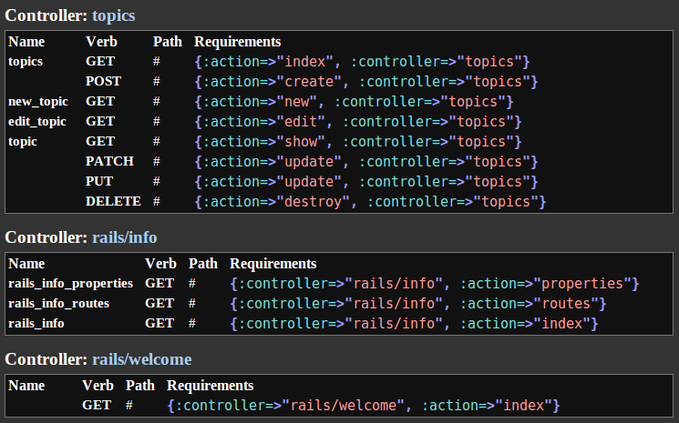

Rails HtmlRoutes
================

Output your Rails routes to html:



## Installation

Add it to your Gemfile and run bundle install:

```ruby
gem 'html_routes'
```

## Usage

```bash
rake html_routes
```

To specify a custom output file:

```bash
rake html_routes out=tmp/custom_file.html
```

If you don't want the output file to open in your browser automatically:

```bash
rake html_routes background=true
```